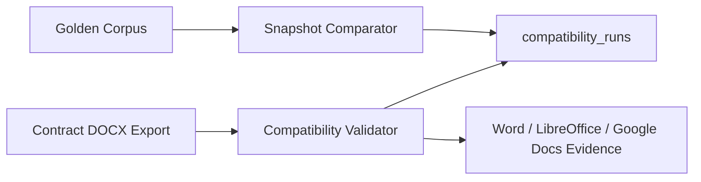
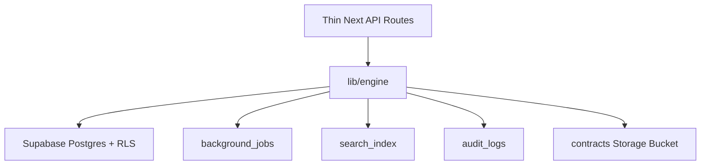

# Phase 24-25 Reconciliation

Status date: 2026-06-28

The prior Phase 24-25 implementation was created in the partial Python handoff
snapshot at `/Users/arpitmalviya/Documents/Dt-physical/.remote-greenlit`.
This reconciliation ports the work additively into the canonical Next.js
checkout at `/Users/arpitmalviya/Downloads/greenlit`.

## Compatibility Pipeline

Implemented TypeScript modules:

- `lib/engine/docx/package.ts`
- `lib/engine/validation/compatibility.ts`
- `lib/engine/regression/golden-corpus.ts`
- `lib/engine/regression/snapshots.ts`

The DOCX package reader/writer is centralized in `lib/engine/docx/package.ts`.
Compatibility validation and snapshot regression both use that helper, so OOXML
ZIP parsing is not duplicated.

Validation covers:

- DOCX ZIP package integrity;
- required OPC parts;
- XML parseability checks;
- content type and relationship target verification;
- round-trip ZIP rewrite/read verification;
- comments, track changes, paragraphs, tables, headers, footers, lists, nested
  numbering, images, hyperlinks, bookmarks, cross references, footnotes,
  endnotes, section breaks, page breaks, styles, custom styles, merged cells,
  content controls, and fields.

External editor targets are represented as explicit evidence states:

- Microsoft Word Desktop;
- Microsoft Word Online;
- LibreOffice;
- Google Docs.

The validator reports `not_run` unless captured editor evidence is supplied.

## Production Infrastructure

Implemented TypeScript modules:

- `lib/engine/infrastructure/config.ts`
- `lib/engine/infrastructure/auth.ts`
- `lib/engine/infrastructure/rbac.ts`
- `lib/engine/infrastructure/jobs.ts`
- `lib/engine/infrastructure/search.ts`
- `lib/engine/infrastructure/audit.ts`

These modules provide environment validation, JWT access/refresh tokens,
password hashing, role permissions, idempotent retry jobs, tenant-scoped search,
and structured audit events.

## Database

Supabase migrations:

- `supabase/migrations/024_compatibility_validation.sql`
- `supabase/migrations/027_production_infrastructure.sql`

Migration `027` is used for Phase 25 because this local checkout already had
untracked `025` and `026` migration files. The migration preserves the existing
`organisations`, `profiles`, and `contracts` schema names used by the canonical
repo.

